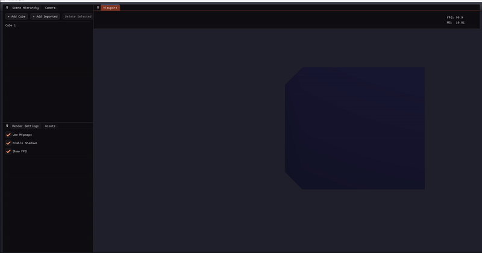

<h1 align="center">🌋MoltenEngine</h1>

<p align="center">
A lightweight <strong>C++20</strong> learning engine using <strong>OpenGL + GLFW</strong>, built with <strong>CMake</strong> and developed in <strong>CLion</strong>.<br/>
Designed to stay small and readable while evolving toward an editor-style workflow.
</p>

<p align="center">
📄 <strong>Architecture Document</strong><br/>
<a href="docs/Architecture.md">Read the Architecture Document</a>
</p>

<h3 align="center">🚧 Progress (Video)</h3>

<p align="center">
  
</p>

<p align="center">
  <a href="progress/EngineProgress12Feb.mp4"><strong>▶️ Watch: EngineProgress12Feb</strong></a>
</p>


---

<h2 align="center">Tech Stack</h2>

- **C++20**, **OpenGL 3.3 Core**
- **GLFW**, **GLAD**, **GLM**
- Build system: **CMake**
- IDE: **CLion** [Windows: MinGW or MSVC]

---

<h2 align="center">Requirements</h2>

- A C++ compiler [MSVC, MinGW, clang, or gcc]
- **CMake 3.16+** recommended
- A working GPU driver with OpenGL support

---

<h2 align="center">Build</h2>

### Windows
```bash
git clone https://github.com/SoftDev-Candy/MoltenEngine.git
cd MoltenEngine
cmake -S . -B build
cmake --build build
