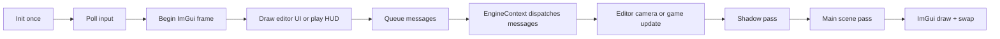

# **🌋MoltenEngine🌋 — Architecture Document**

> **What this is:** MoltenEngine is a small C++ editor-style engine prototype built to prove an end-to-end pipeline:  
> **Scene → Entity data → Renderer (OpenGL) → Assets (OBJ + textures) → Editor UI (ImGui) → Commands (MessageQueue)**

Note : This document is not final and is subject to change as the project progresses. 
---

## Contents

| # | Section | What it covers |
|---:|---|---|
| 1 | [Why MoltenEngine exists](#1-why-moltenengine-exists) | Goals, constraints, and design rules |
| 2 | [Core loop](#2-core-loop-what-happens-every-frame) | Init → Update → UI → Messages → Render |
| 3 | [Project structure map](#3-project-structure-map) | Folder + file responsibilities |
| 4 | [Scene and entity model](#4-the-data-model-scene--objects--components) | `SceneObject`, selection, deletion, lights, material keys |
| 5 | [Rendering pipeline](#5-rendering-pipeline-mvp--textures--lights--shadows) | Shadow pass, main pass, helper rendering, material binding |
| 6 | [Asset pipeline](#6-asset-pipeline-mesh--texture--obj) | Mesh/Texture managers + OBJ import + startup asset loading |
| 7 | [Editor UI](#7-editor-ui-hierarchy--inspector--assets) | Hierarchy + Inspector + Assets + drag/drop + play HUD |
| 8 | [Message system](#8-message-system-ui-asks-engine-does) | Decoupling UI actions from engine state + save/load flow |
| 9 | [Lifetime and shutdown](#9-lifetime--shutdown-avoiding-leaks-and-gl-traps) | Clearing managers before GL context dies |
| 10 | [Showcase snippets](#10-code-snippets) | Where to paste “proud code” blocks |
| 11 | [Limitations and next steps](#11-known-limitations--next-steps) | Current gaps + logical future upgrades |
| 12 | [2026 upgrade snapshot](#12-2026-upgrade-snapshot) | Gameplay, gizmos, lighting, and editor upgrades |

---

## 1. Why MoltenEngine exists

Most beginner engines become unmaintainable because everything gets wired together too early:
- UI directly edits engine state everywhere
- Renderer owns the scene or controls gameplay logic
- Assets are raw pointers floating around without ownership
- Importing meshes/textures becomes copy-paste chaos

MoltenEngine is built to **avoid that trap** while still shipping features quickly.

### Guiding design rules
- **Scene owns state** (entities, transforms, mesh assignments, texture/material assignments, lights)
- **Renderer reads state** (does not own objects)
- **Managers own lifetimes** (`MeshManager` / `TextureManager`)
- **UI mostly expresses intent** (through `MessageQueue`)  
  I am writing “mostly” on purpose because some inspector edits still mutate the selected object directly right now
- **EngineContext is the orchestrator** (glue layer + execution authority)

That last bullet matters a lot because `EngineContext` is where startup, message dispatch, editor/game mode switching, camera handling, save/load, and renderer setup all meet.

### Quick ownership map

| Thing | Who owns it | Who mainly reads/uses it | Why it is done this way |
|---|---|---|---|
| `SceneObject` data | `Scene` | `Renderer`, `UIManager`, gameplay | One source of truth |
| Mesh GPU buffers | `Mesh` | `Renderer` | Keeps OpenGL setup out of gameplay/UI |
| Texture GPU objects | `Texture` | `Renderer` | Same idea, cleaner binding path |
| Mesh/texture lookup | Managers | `EngineContext` + UI | Reuse by key, no duplicate loads |
| Message queue | `MessageQueue` | UI pushes, engine drains | Keeps the editor from owning rules |
| Overall frame flow | `EngineContext` | basically everything | Central coordination layer |

**Entry points:**
- [`../src/main.cpp`](../src/main.cpp)
- [`../src/EngineContext.cpp`](../src/EngineContext.cpp) / [`../src/EngineContext.hpp`](../src/EngineContext.hpp)

---

## 2. Core loop (what happens every frame)

MoltenEngine uses an editor-style frame loop:

### Init (one time)
- Create window (GLFW)
- Load OpenGL functions (GLAD)
- Setup OpenGL state (viewport, depth test)
- Setup ImGui (docking enabled)
- Load default shader
- Load default mesh(es)
- Load default texture
- Load some OBJ meshes into `MeshManager`
- Setup helper meshes for empty objects / lights

**Why:** “Proof of pipeline” matters more than perfect architecture early. Once the loop is stable, everything else can be modularized.

### Actual startup stuff that happens now

| Asset key | Kind | Where it comes from | Note |
|---|---|---|---|
| `Cube` | Mesh | hardcoded cube data | fallback mesh + helper mesh source |
| `Default` | Shader | built from `ShaderSource.cpp` strings | main forward shader |
| `Default` | Texture | `../assets/FlatNormalMap.png` | current fallback texture |
| `ImportedOBJ` | Mesh | `../assets/models/d5class.obj` | default imported ship-ish mesh |
| `Asteroid_1d`, `Asteroid_1c`, `Asteroid_2f_small` | Mesh | auto-import by prefix if files exist | gameplay helpers |
| `LightGizmo` | Mesh | `../assets/models/LightGizmo.obj` if present | used for light arrows/gizmos |

**See:** [`../src/EngineContext.cpp`](../src/EngineContext.cpp)

### Update (every frame)
- Poll input (camera movement / play controls)
- Start ImGui frame
- Draw either editor UI or play HUD depending on engine mode
- UI pushes messages (create/delete/import/assign/play/stop/save/load/light edits)
- Engine pops and executes messages (mutating `Scene` + managers)
- Run either editor camera controls or `SplineShooterGame`

**Why:** UI stays lightweight and doesn’t own core rules. It can be rewritten later without breaking the engine.

### Mode split (editor vs play)
- **Editor mode** draws the docked editor windows, gizmos, lights panel, camera panel, asset browser, and render settings
- **Play mode** hides the editor panels and only draws the game HUD / main menu overlay
- Pressing `Play` switches engine mode to Play and calls `SplineShooterGame::Start(scene)`
- Starting the actual round from the play overlay (or using Enter) calls `SplineShooterGame::BeginRound(scene)`
- `Stop` restores editor mode, removes runtime gameplay objects, and restores the previous editor light setup

That split is important because “play mode” is not instantly “the round is already running”. There is a small menu / start state in between now.

### Tiny flow graph



### Render (every frame)
- Clear buffers
- Render shadow map from the first light
- Render the scene with main shader + material textures + up to 8 lights
- Render helper visuals for empty objects
- Render light gizmos
- Render ImGui on top
- Swap buffers

**See:** [`../src/Renderer.cpp`](../src/Renderer.cpp)

---

## 3. Project structure map

This repo is split into “engine core”, “editor UI”, “assets/managers”, and “messages”.

### Assets
- `assets/models/*.obj`
- `assets/textures/*.png`
- `progress/*.gif` (great for README / demo)

### Scenes and docs
- `scenes/*.json`
- `docs/*.md`

### External dependencies
- `external/glfw`, `external/glad`, `external/glm`, `external/imgui`, `external/ImGuizmo`, `external/stb`

### Engine overview [links[↗]]
| Area | Responsibility | Key files |
|---|---|---|
| **Engine orchestration** | Init / update / render / shutdown flow + message execution | [`../src/EngineContext.cpp`](../src/EngineContext.cpp)<br>[`../src/EngineContext.hpp`](../src/EngineContext.hpp)<br>[`../src/main.cpp`](../src/main.cpp) |
| **Scene model** | Stores objects + lights + selection-safe deletion + transform/component ownership | [`../src/Scene.cpp`](../src/Scene.cpp)<br>[`../src/Scene.hpp`](../src/Scene.hpp)<br><br>[`../src/Entity.cpp`](../src/Entity.cpp)<br>[`../src/Entity.hpp`](../src/Entity.hpp)<br><br>[`../src/Transform.cpp`](../src/Transform.cpp)<br>[`../src/Transform.hpp`](../src/Transform.hpp)<br><br>[`../src/MeshComponent.cpp`](../src/MeshComponent.cpp)<br>[`../src/MeshComponent.hpp`](../src/MeshComponent.hpp) |
| **Rendering** | Draw pipeline (shadow pass + main pass + helper rendering) | [`../src/Renderer.cpp`](../src/Renderer.cpp)<br>[`../src/Renderer.hpp`](../src/Renderer.hpp)<br><br>[`../src/Shader.cpp`](../src/Shader.cpp)<br>[`../src/Shader.hpp`](../src/Shader.hpp)<br><br>[`../src/ShaderManager.cpp`](../src/ShaderManager.cpp)<br>[`../src/ShaderManager.hpp`](../src/ShaderManager.hpp)<br><br>[`../src/ShaderSource.cpp`](../src/ShaderSource.cpp)<br>[`../src/ShaderSource.hpp`](../src/ShaderSource.hpp) |
| **Assets** | GPU upload + asset file import/parsing | [`../src/Mesh.cpp`](../src/Mesh.cpp)<br>[`../src/Mesh.hpp`](../src/Mesh.hpp)<br><br>[`../src/Texture.cpp`](../src/Texture.cpp)<br>[`../src/Texture.hpp`](../src/Texture.hpp)<br><br>[`../src/ObjLoader.cpp`](../src/ObjLoader.cpp)<br>[`../src/ObjLoader.hpp`](../src/ObjLoader.hpp) |
| **Managers** | Caching + ownership + source path tracking | [`../src/MeshManager.cpp`](../src/MeshManager.cpp)<br>[`../src/MeshManager.hpp`](../src/MeshManager.hpp)<br><br>[`../src/TextureManager.cpp`](../src/TextureManager.cpp)<br>[`../src/TextureManager.hpp`](../src/TextureManager.hpp) |
| **Editor** | UI windows + widgets + theme (ImGui layer) | [`../src/ui/UIManager.cpp`](../src/ui/UIManager.cpp)<br>[`../src/ui/UIManager.hpp`](../src/ui/UIManager.hpp)<br><br>[`../src/ui/EditorStyle.cpp`](../src/ui/EditorStyle.cpp)<br>[`../src/ui/EditorStyle.hpp`](../src/ui/EditorStyle.hpp)<br><br>[`../src/ui/EditorWidgets.cpp`](../src/ui/EditorWidgets.cpp)<br>[`../src/ui/EditorWidgets.hpp`](../src/ui/EditorWidgets.hpp) |
| **Messages + save/load** | Commands from UI → engine + serialization | [`../src/message/Message.hpp`](../src/message/Message.hpp)<br>[`../src/message/MessageQueue.hpp`](../src/message/MessageQueue.hpp)<br>[`../src/message/SceneSerializer.cpp`](../src/message/SceneSerializer.cpp)<br>[`../src/message/SceneSerializer.hpp`](../src/message/SceneSerializer.hpp)<br><br>Concrete messages: `CreateEntityMessage`, `DeleteEntityMessage`, `ImportMeshMessage`, `ImportTextureMessage`, `SetEntityMeshMessage`, `SetEntityTextureMessage`, `SaveSceneMessage`, `LoadSceneMessage`, `StartGameMessage`, `StopGameMessage`, light/material messages |
| **Gameplay** | Spline shooter runtime logic + play HUD + round flow | [`../game/Game.cpp`](../game/Game.cpp)<br>[`../game/Game.hpp`](../game/Game.hpp)<br><br>[`../game/GameUI.cpp`](../game/GameUI.cpp)<br>[`../game/GameUI.hpp`](../game/GameUI.hpp) |

---

## 4. The data model: Scene → Objects → Components

MoltenEngine uses a simple ECS-ish model (not a full ECS):

### SceneObject (what one “entity” holds)
Each object stores:
- `Entity entity` (ID)
- `Transform transform` (position/rotation/scale)
- `MeshComponent mesh` (`Mesh*` wrapper)
- `std::string name`
- `meshKey` for UI + drag/drop lookup
- `textureKey` + `Texture* texture` for the older single-texture path
- `albedoKey` + `Texture* albedo` for the current main color map path
- `specularKey` + `Texture* specular` for the current specular mask path
- `float shininess` for Phong-ish spec highlights

**Why the keys exist (yes it’s hacky but useful):**
- UI needs something stable to display and drag-drop
- Managers store assets by string key
- Storing only pointers would make the inspector harder (you can’t label a pointer meaningfully)
- This helps debug “why is it drawing wrong?” quickly

Also, the object struct still carries both the older single-texture path and the newer albedo/specular path. `textureKey`/`texture` are still there because earlier code used one texture slot, while newer code uses `albedo` + `specular`.

**Your current struct (source of truth):**  
[`../src/Scene.hpp`](../src/Scene.hpp)

### Lights also live in Scene
`Scene` now stores a `std::vector<Light>` and starts with one default light already in it.

Each light stores:
- `LightType` (`Spot`, `Point`, `Directional`)
- position
- rotation
- color
- intensity
- ambient strength
- inner + outer spotlight angles

**Why lights are scene data too:**
- they are edited in the UI
- the renderer reads them every frame
- gameplay can temporarily replace or modify them in play mode

Right now the renderer uses:
- **first light** for the shadow map pass
- **up to 8 lights** for the main forward-lit pass

### Scene storage choice
Scene stores objects in a `std::vector<SceneObject>`.

**Why a vector:**
- Simple iteration (great for renderer)
- Simple inspector selection by index
- Fast enough for a small engine prototype

**Trade-off:**
Deleting an object shifts indices, so selection must be fixed.

### Deletion strategy (the important part)
MoltenEngine supports:
- `DestroyObjectAt(index)` for UI convenience
- `DestroyObject(entity)` for future-proofing
- `DeleteEntity(entity, selectedIndex)` as the improved version that also repairs selection

**Why the improved delete exists:**
- Prevents `selectedIndex` from pointing into freed/shifted objects
- Avoids “selection points into garbage” bugs (classic editor crash)

**See:** `Scene::DeleteEntity()` in [`../src/Scene.hpp`](../src/Scene.hpp)

### Common object flavors in the scene right now

| Kind of object | What it usually has | Why it exists |
|---|---|---|
| Normal render object | mesh + transform + material keys | regular editor content |
| Empty helper object | no mesh | placeholders, gizmos, quick transforms |
| `SplinePoint_X` object | usually empty helper | spline control point for gameplay path |
| Runtime bullet / asteroid / player | mesh + transform + runtime naming | spawned during play, not meant to stay in saved editor scenes |

---

## 5. Rendering pipeline (MVP + textures + lights + shadows)

Rendering happens in `Renderer::RenderScene(scene, camera)`.

### Actual pass order now

| Pass | What it draws | Why it exists |
|---|---|---|
| Shadow pass | depth only from light 0 | gives basic shadows without doing anything too fancy |
| Main forward pass | all mesh objects | actual visible shaded scene |
| Empty helper pass | wireframe helper cubes for empty objects | makes empty objects visible in the editor |
| Light gizmo pass | light arrows / gizmos | easier light editing in editor |
| ImGui overlay | editor panels or play HUD | editor/game UI |

### Main shader inputs
The current main shader takes:
- `aPos` at location 0
- `aUV` at location 1
- `aNormal` at location 2
- albedo texture
- specular texture
- shadow map
- view position
- up to 8 lights
- per-object `uShininess`

So the current “real” vertex format is:
- Position (x, y, z)
- UV (u, v)
- Normal (nx, ny, nz)

That means **8 floats per vertex**, not 5.  
The old version of this document said 5 floats because that was true earlier, but it is outdated now.

### Per-object rendering steps
For each mesh object:
1. Compute model matrix from `Transform`
2. Compute view/projection from `Camera`
3. Build `MVP = projection * view * model`
4. Bind shader
5. Push shared scene uniforms (lights, shadow map, camera position)
6. Pick albedo/specular textures
7. Bind mesh VAO and draw indexed triangles

### Current material fallback rules
This is actually kind of important because it explains why models usually still draw even when assignments are missing:

- Albedo priority:
  - per-object `albedo`
  - else legacy `texture`
  - else engine active texture
  - else default texture
- Specular priority:
  - per-object `specular`
  - else use albedo texture as fallback

**Why it’s structured this way:**
- Renderer stays responsible for GPU calls
- Scene stays purely data
- Per-entity materials are supported without adding a whole `Material` class yet
- “Black model” issues are prevented by a default texture fallback

### Current renderer notes
- It is still basically a forward renderer with one big main shader
- Shadows only come from the first light
- There is not a full separate material system yet
- But for a student engine prototype it is already doing a lot more than plain textured cubes

**See:** [`../src/Renderer.cpp`](../src/Renderer.cpp)  
Shader inputs: [`../src/ShaderSource.cpp`](../src/ShaderSource.cpp)

---

## 6. Asset pipeline (Mesh + Texture + OBJ)

### Mesh (GPU buffer owner)
Mesh owns VAO/VBO/EBO and knows its index count.

**Why Mesh encapsulates OpenGL buffers:**
- Keeps OpenGL boilerplate out of `EngineContext`/`Renderer`
- Enforces RAII-ish cleanup in destructor
- Makes draw calls clean (`mesh->Bind()`)

**See:** [`../src/Mesh.cpp`](../src/Mesh.cpp)

### MeshManager (asset cache)
`MeshManager` owns meshes using `std::unique_ptr<Mesh>`.

**Why:**
- Prevents memory leaks
- Lets multiple entities share the same mesh pointer safely
- Makes “import mesh” behave like an engine system, not a special case

It also stores **source paths** now, which helps with:
- asset browser display
- save/load re-import
- answering “where did this mesh come from?”

**See:** [`../src/MeshManager.cpp`](../src/MeshManager.cpp)

### Texture + TextureManager (same idea)
Texture loads image data via stb_image, uploads to OpenGL, and binds later.  
`TextureManager` caches textures by key and also tracks source paths.

**Why:**
- Supports per-entity textures/material maps
- Supports drag/drop asset assignment by key
- Lets renderer pick defaults cleanly
- Makes scene save/load much less annoying

**See:**
- [`../src/Texture.cpp`](../src/Texture.cpp)
- [`../src/TextureManager.cpp`](../src/TextureManager.cpp)

### OBJ Loader (file → vertex/index arrays)
OBJ loader outputs `ObjMeshData { vertices, indices }` in the format MoltenEngine expects.

**Current MoltenEngine vertex format:**
- Position (x, y, z)
- UV (u, v)
- Normal (nx, ny, nz)

So each vertex is **8 floats**.

**Loader behavior right now:**
- triangulates faces
- deduplicates using OBJ triplets (`v`, `vt`, `vn`)
- packs data to match the shader / mesh layout

**Why:** It matches the shader input (`aPos` + `aUV` + `aNormal`) and the `Mesh` stride.

**See:**
- [`../src/ObjLoader.cpp`](../src/ObjLoader.cpp)
- [`../src/ShaderSource.cpp`](../src/ShaderSource.cpp)

### Scene save/load is now part of the pipeline too
The older version of this doc said persistence was missing. That is not true anymore.

Current save data includes:
- render settings (`mipmapsEnabled`, `shadowsEnabled`)
- camera data
- light list
- asset source path lists
- objects with transform + mesh/material keys

On load, the engine:
1. reads JSON
2. re-imports assets by saved source paths
3. rebuilds objects/lights/camera state
4. rebinds raw mesh/texture pointers from the manager keys

That key-based rebind step is the thing that makes the save format work without trying to serialize raw pointers.

### Tiny JSON shape sketch

```json
{
  "settings": {
    "mipmapsEnabled": true,
    "shadowsEnabled": true
  },
  "camera": {},
  "lights": [],
  "meshAssets": {},
  "textureAssets": {},
  "objects": [
    {
      "name": "Player",
      "meshKey": "ImportedOBJ",
      "textureKey": "Default",
      "albedoKey": "Asteroid1d_Color_1K",
      "specularKey": "Asteroid1d_Color_1K"
    }
  ]
}
```

---

## 7. Editor UI (Hierarchy / Inspector / Assets)

The editor is built with ImGui and is split into:
- `EditorStyle` (theme)
- `EditorWidgets` (custom molten slider, styling helpers)
- `UIManager` (windows + interactions)

### Current editor windows
- **Scene Hierarchy**
- **Inspector Panel**
- **Camera**
- **Assets**
- **Lights**
- **Render Settings**
- **Main menu bar** (play/stop/save/load)

### Hierarchy window
- Shows list of objects by name
- Selection changes `selectedIndex`
- Create buttons add new entities
- Delete button removes selected entity
- Can create cubes, empty objects, and auto-numbered `SplinePoint_0..N`

**See:** [`../src/ui/UIManager.cpp`](../src/ui/UIManager.cpp)

### Camera window
Edits:
- FOV
- camera position
- camera rotation

This one is very direct and practical. It keeps the camera easy to move while building scenes.

### Inspector window
Edits selected object:
- name
- mesh/model selection (combo + drag/drop)
- texture selection (combo + drag/drop)
- albedo selection
- specular selection
- shininess
- transform editing (`DragFloat3`)

**Why combo + drag/drop:**
- Combo proves “systems exist”
- Drag/drop proves “editor workflow”

### Assets window
- Import OBJ: path + key
- Import texture: path + key
- Lists loaded meshes/textures
- Shows source paths
- Supports drag payloads
- Has a project browser style tab now, not just one giant dump

### Lights window
- add spot / point / directional-ish light presets
- delete selected light
- edit position, rotation, color, intensity, ambient, angles
- preview the result immediately in the scene

### Render Settings window
- toggle mipmaps
- toggle shadows

This section is architecture-relevant because these toggles now go through message dispatch instead of the UI directly flipping renderer state.

### New editor tooling
- **ImGuizmo** is used for translate / rotate / scale in the main scene window
- **Empty objects** render with helper shapes so spline points and placeholders are visible in the scene
- **Light gizmos** render in the scene so lighting is not guesswork

### Play HUD separation
- Editor UI is not drawn in Play mode
- Play mode uses `UIManager::DrawPlayHUD(...)`, which delegates the actual layout to `game/GameUI.cpp`
- The play overlay shows a small in-game HUD while playing and a centered menu card for start / win / lose states

### Architecture note
This is where the clean-message-boundary story becomes “mostly true” instead of “100% true”.

Right now:
- create/delete/import/save/load/play/stop/light edits mostly go through messages
- albedo/specular/shininess also go through messages
- but some inspector edits still directly modify scene data (`name`, some mesh/texture assignment paths, and transform values)

So the architecture is heading in the right direction, but the inspector still has some direct-edit paths.

---

## 8. Message system (UI asks, Engine does)

This is the architectural boundary that prevents UI spaghetti.

### MessageQueue
- UI pushes `unique_ptr<Message>`
- Engine drains queue and executes actions

**Why messages:**
- UI doesn’t need to know engine internals
- Engine owns mutation rules (safe deletes, default textures, manager caching)
- Makes it easier later to add undo/redo, logging, replay, or networking

**See:**
- [`../src/message/Message.hpp`](../src/message/Message.hpp)
- [`../src/message/MessageQueue.hpp`](../src/message/MessageQueue.hpp)

### Message types currently doing real work

| Category | Examples |
|---|---|
| Scene objects | `CreateEntityMessage`, `DeleteEntityMessage` |
| Asset import | `ImportMeshMessage`, `ImportTextureMessage` |
| Material assignment | `SetEntityMeshMessage`, `SetEntityTextureMessage`, `SetEntityAlbedoMessage`, `SetEntitySpecularMessage`, `SetEntityShininessMessage` |
| Render settings | `SetMipmapsEnabledMessage`, `SetShadowsEnabledMessage` |
| Lights | `AddLightMessage`, `DeleteLightMessage`, `UpdateLightMessage` |
| Scene IO | `SaveSceneMessage`, `LoadSceneMessage` |
| Play flow | `StartGameMessage`, `StopGameMessage` |

### Save/load path (this is one of the big upgrades)
- Menu bar UI pushes `SaveSceneMessage` / `LoadSceneMessage`
- Message dispatch lands in `EngineContext`
- `EngineContext` calls `SceneSerializer`
- serializer writes/reads JSON
- asset keys are used to restore mesh/texture pointers after load

So save/load is no longer “future work”, it is now part of the engine loop.

### One message that still looks unfinished
`FileDroppedMessage` exists as a type, but it is mostly just a stub at the moment.  
So drag/drop is implemented for in-editor asset assignment, but OS-level file drop handling still looks unfinished.

---

## 9. Lifetime + shutdown (avoiding leaks and GL traps)

OpenGL resources should be deleted **before the OpenGL context is destroyed**.

### Shutdown order
1. Shutdown ImGui backends
2. Clear asset managers (delete textures and meshes while context is valid)
3. Destroy window, terminate GLFW

**Why:** If you delete OpenGL objects after the context is gone, behavior becomes undefined (and drivers vary).

**Enforced in:** `EngineContext::Terminate()`  
**See:** [`../src/EngineContext.cpp`](../src/EngineContext.cpp)

### Current cleanup note
The shutdown *plan* is right, but there are still some cleanup rough edges in the codebase:
- `Texture::~Texture()` is empty right now
- `Shader` creates a GL program but does not currently show matching teardown
- shadow framebuffer/depth texture resources are created by `Renderer` and need proper cleanup too

So the architecture intention is good, but there is still some resource-cleanup debt to fix.

---

## 12. 2026 upgrade snapshot

This section is the “what the engine actually does now” cheat sheet.

### Gameplay layer
- `SplineShooterGame` is the current game-side runtime layer
- Supports `Start`, `Playing`, `Win`, and `Lose`
- Win triggers when the player reaches the end of the spline
- Player movement supports both spline-follow and free-fly modes
- Runtime-only bullets, obstacles, and backdrop asteroids are spawned and cleaned without polluting saved scenes

### Current game states

| State | What it means |
|---|---|
| `Start` | play mode is active but the round has not actually begun yet |
| `Playing` | live gameplay update + HUD |
| `Win` | player reached the end of the path |
| `Lose` | player health hit zero / collision loss |

### Control modes

| Mode | What it does |
|---|---|
| `FreeFly` | free movement/testing style control |
| `SplineFollow` | player rides the Catmull-Rom path and dodges with lane offsets |

### Spline path rules
- Control points are collected from scene objects named `SplinePoint_0 .. SplinePoint_n`
- Points are sorted by numeric suffix before Catmull-Rom sampling
- Player follows the spline centerline, then applies lane offsets for dodge movement
- Camera now uses a separate rail-follow rig so player strafing does not yank the whole camera sideways

This naming-rule approach is simple, readable, and works well for the current project.

### Asteroid variants
- Two asteroid meshes are supported in gameplay: `Asteroid_1d` and `Asteroid_1c`
- Primary asteroid uses `Asteroid1d_Color_1K`
- Secondary asteroid uses `9SliceTableTexture` + `9SliceTableTexture_Specular`
- Current shader does not consume a normal map yet, so `9SliceTableTexture_Normal` is imported for future use but not rendered as a normal-mapped material
- Primary asteroid hits harder, secondary asteroid is the lighter variant

### Space feel and lighting
- Play mode uses a follow light that sits behind and above the player, points forward, and restores the editor light state on stop
- Runtime backdrop asteroids are spawned around the spline so the player reads as flying through an asteroid field instead of empty space
- Clear color was pushed darker to feel more space-like

### Asset and scene stability
- Scene serialization remains key-based (`meshKey`, `textureKey`, `albedoKey`, `specularKey`)
- Raw mesh / texture pointers are rebound after load through the managers
- Auto-import helpers now pick up gameplay assets like asteroid meshes and play textures when those files exist in the project assets folder

---

## 10. Code Snippets

### Showcase A — Main render pass in Renderer
**File:** [`../src/Renderer.cpp`](../src/Renderer.cpp)

```cpp
for (auto& sceneObject : scene.GetObjects())
{
    if (sceneObject.mesh.mesh == nullptr)
    {
        continue;
    }

    glm::mat4 model = sceneObject.transform.GetMatrix();
    glm::mat4 mvp = projection * view * model;

    shaderptr->bind();
    shaderptr->setMat4("uModel", model);
    shaderptr->setMat4("MVP", mvp);
    ApplySharedSceneUniforms();
    shaderptr->setInt("uUseTintColor", 0);
    shaderptr->setFloat("uShininess", sceneObject.shininess);

    Texture* albedoTexture = nullptr;
    Texture* specularTexture = nullptr;

    if (sceneObject.albedo) albedoTexture = sceneObject.albedo;
    else if (sceneObject.texture) albedoTexture = sceneObject.texture;
    else if (textureptr) albedoTexture = textureptr;
    else albedoTexture = defaultTexture;

    if (sceneObject.specular) specularTexture = sceneObject.specular;
    else specularTexture = albedoTexture;

    BindMaterialTextures(albedoTexture, specularTexture);

    sceneObject.mesh.mesh->Bind();
    glDrawElements(GL_TRIANGLES, sceneObject.mesh.mesh->GetIndexCount(), GL_UNSIGNED_INT, 0);
}
```

### Showcase B — MeshManager caching (engine-quality)

**File:** [`../src/MeshManager.cpp`](../src/MeshManager.cpp)

```cpp
Mesh* MeshManager::Add(const std::string key, std::unique_ptr<Mesh> mesh)
{
    auto it = meshes.find(key);
    if (it != meshes.end())
    {
        return it->second.get();
    }

    meshes.emplace(key, std::move(mesh));
    return meshes.at(key).get();
}
```

### Showcase C — MessageQueue swap trick (clean design)

**File:** [`../src/message/MessageQueue.hpp`](../src/message/MessageQueue.hpp)

```cpp
std::vector<std::unique_ptr<Message>> PopAll()
{
    std::lock_guard<std::mutex> lock(mutex);

    std::vector<std::unique_ptr<Message>> out;
    out.swap(messages); // fast + leaves messages empty

    return out;
}
```

### Showcase D — Drag/drop payload (editor workflow)

**File:** [`../src/ui/UIManager.cpp`](../src/ui/UIManager.cpp)

```cpp
ImGui::TextUnformatted("Textures (drag onto Texture)");
{
    std::vector<std::string> keys = listTextureKeys();
    for (const std::string& k : keys)
    {
        ImGui::Selectable(k.c_str());

        if (ImGui::BeginDragDropSource())
        {
            ImGui::SetDragDropPayload("TEX_KEY", k.c_str(), k.size() + 1);
            ImGui::Text("Texture: %s", k.c_str());
            ImGui::EndDragDropSource();
        }
    }
}
```

**Payload delivery**

```cpp
if (ImGui::BeginDragDropTarget())
{
    if (const ImGuiPayload* payload = ImGui::AcceptDragDropPayload("MESH_KEY"))
    {
        const char* droppedKey = (const char*)payload->Data;
        Mesh* m = getMeshByKey(droppedKey);
        if (m != nullptr)
        {
            obj.mesh.mesh = m;
            obj.meshKey = droppedKey;
        }
    }
    ImGui::EndDragDropTarget();
}
```

### Showcase E — OBJ import pipeline (file → GPU mesh)

**File:** [`../src/EngineContext.cpp`](../src/EngineContext.cpp)

```cpp
bool EngineContext::ImportObjAsMesh(const std::string& key, const std::string& path)
{
    ObjMeshData imported = LoadOBJ(path, false);

    if (imported.vertices.empty() || imported.indices.empty())
    {
        std::cerr << "[EngineContext] ImportObjAsMesh failed: empty mesh data\n";
        return false;
    }

    if ((imported.vertices.size() % 8) != 0)
    {
        std::cerr << "[EngineContext] WARNING: OBJ vertices not multiple of 8 (pos+uv+normal).\n";
    }

    meshmanager.Add(key,
        std::make_unique<Mesh>(
            imported.vertices.data(),
            imported.vertices.size(),
            imported.indices.data(),
            imported.indices.size(),
            8
        )
    );

    return true;
}
```

### Showcase F — Spline points by naming convention

**File:** [`../game/Game.cpp`](../game/Game.cpp)

```cpp
std::vector<glm::vec3> SplineShooterGame::CollectSplineControlPoints(Scene& scene)
{
    std::vector<std::pair<int, glm::vec3>> indexedPoints;

    for (const SceneObject& sceneObject : scene.GetObjects())
    {
        if (!StartsWithPrefix(sceneObject.name, "SplinePoint_"))
        {
            continue;
        }

        // parse the number after SplinePoint_
        // then sort by that number before sampling
    }

    // convert sorted pairs to a clean vec3 list
    return controlPoints;
}
```

---

## 11. Known limitations + next steps

# Known limitations
* Scene storage: `Scene` uses vector storage (deletions shift indices; selection is repaired but long-term ECS would help).
* UI boundary: the engine is only **mostly** message-driven; some inspector edits still directly mutate scene objects.
* Renderer: one big forward shader still does a lot of jobs at once.
* Shadows: only the first light feeds the shadow map.
* Render setting state: save/load stores engine booleans for mipmaps/shadows, but the UI currently keeps its own checkbox state too, so that path still needs tightening.
* Resource cleanup: texture/shader/shadow-map teardown is not fully finished yet.
* Texture loading: failure handling and vertical-flip ordering in `Texture.cpp` still need cleanup.
* File drop pipeline: `FileDroppedMessage` exists but is not really wired into a full workflow yet.
* Build docs mismatch: `README.md` says CMake 3.16+ but `CMakeLists.txt` currently requires 4.0.
* Extra target: `SplineShooter` is declared in CMake but looks incomplete compared to the real main executable.

# Next steps (logical upgrades)
* Material system: add a real `Material` struct/class so the object struct is less half-old-half-new.
* Command history: add undo/redo by storing reverse operations in the message system.
* Inspector cleanup: move the remaining direct scene edits behind messages or command handlers.
* Rendering: split helper/gizmo rendering a bit more cleanly from the main object pass.
* Resource cleanup: finish GL teardown for shader programs, textures, and shadow resources.
* File IO: finish drag-in file import flow so OS file drops become useful.
* Docs/build cleanup: make README + CMake agree and either finish or remove the extra `SplineShooter` target.
